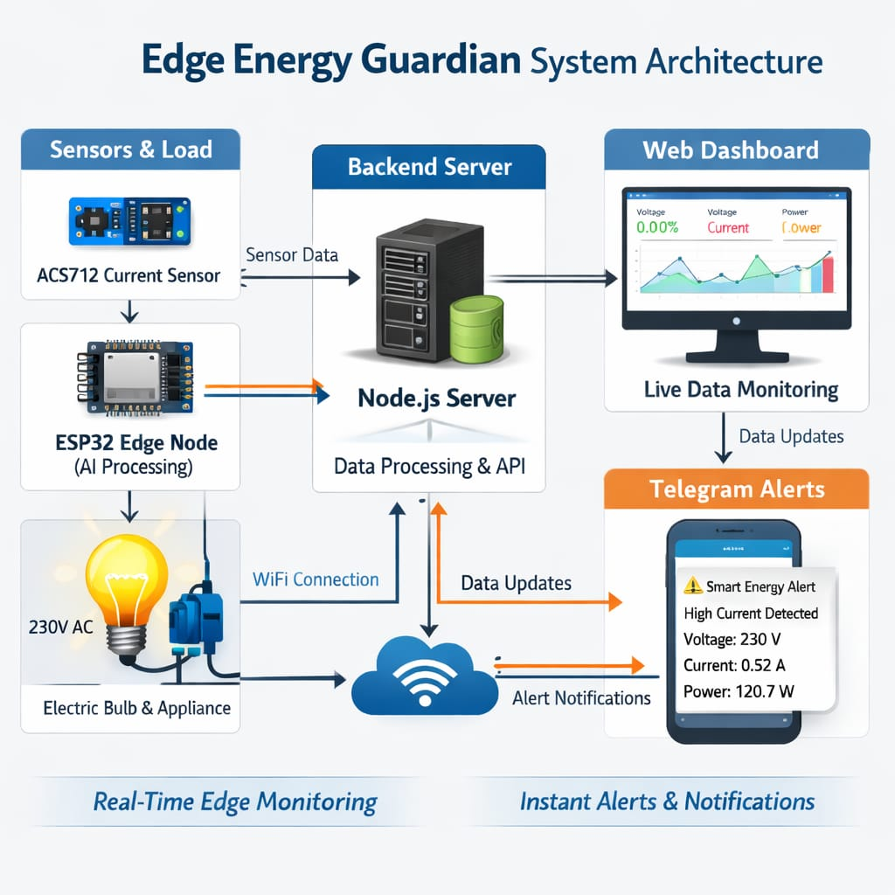
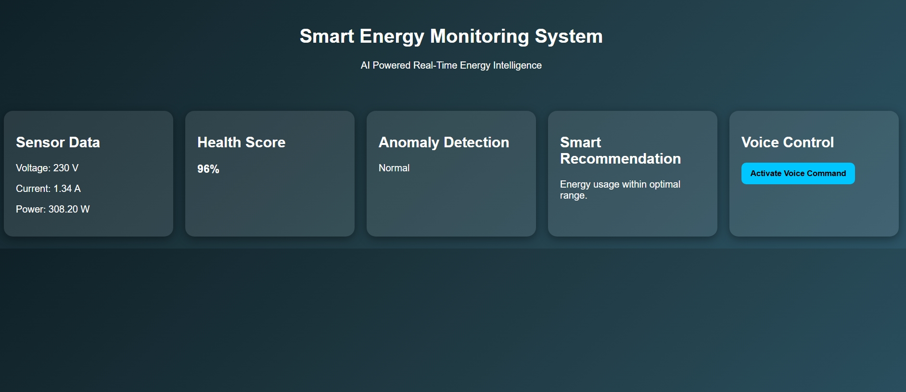
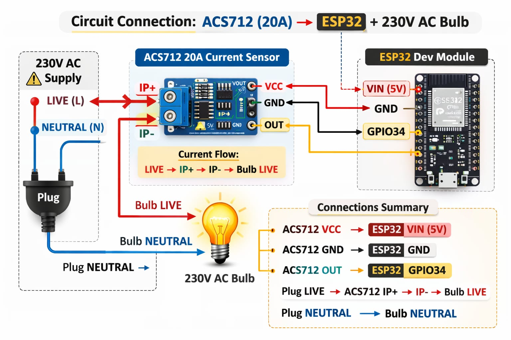

⚡ Edge Energy Guardian
Edge-Based Smart Electrical Equipment Health Monitoring System

---

1️⃣ What the Project Does

Edge Energy Guardian is an IoT-based real-time electrical monitoring system that detects abnormal voltage and current conditions before they cause equipment failure.

The system uses an ESP32 microcontroller and electrical sensors to continuously monitor:

Voltage

Current

Power consumption

The collected data is sent to a cloud database and displayed on a live dashboard.
If abnormal conditions (such as overcurrent or voltage fluctuations) are detected, the system sends instant Telegram alerts.

This enables early detection and preventive action.

---

---

## 🧩 System Architecture

This visually explains what the project does.

2️. Why the Project is Useful

Electrical equipment failures can lead to:

Equipment damage

Fire hazards

Unexpected downtime

Increased maintenance cost

Most monitoring systems are expensive and not accessible for small-scale users.

Edge Energy Guardian provides:

Low-cost monitoring

Real-time alerts

Preventive maintenance

Improved safety

It is especially useful for:

Smart homes

Laboratories

Small industries

Educational institutions

## 📊 Dashboard Preview

---

This proves usefulness.

---

3️. How Users Can Get Started with the Project
Hardware Setup:

1. Connect current and voltage sensors to ESP32.
2. Connect load (bulb/appliance).
3. Power the ESP32.

Firmware Setup

1. Install Arduino IDE.
2. Install ESP32 board package.
3. Upload firmware code.
4. Configure WiFi credentials.

Cloud Setup

1. Create Firebase project.
2. Generate database URL.
3. Add device node in Firebase.
4. Update database credentials in firmware.

0Backend Setup

1. Install Node.js.
2. Run npm install
3. Start server with node server.js
Once configured, the system begins real-time monitoring.

---

---

## 🔌 Circuit Connections

These images make your setup credible.
---

4️. Where Users Can Get Help with the Project?:

If users face issues, they can:

Check documentation inside the repository
Review configuration steps in README
Raise an issue in the GitHub Issues section
Contact the maintainer via email

For technical problems:
Verify WiFi credentials
Check Firebase configuration
Confirm sensor connections
Ensure correct threshold values

---

📷 Image to Upload for This Section

Upload:
telegram_alert.png

Insert:

  

This shows what alert looks like if something goes wrong.

5️. Who Maintains and Contributes to the Project
Maintainer:K.V.Seshu Babu
B.Tech Student
Department:ECE
Your College Name:SRKR ENGINEERING COLLEGE

This project is currently maintained as an academic and research prototype.
Contributions are welcome in areas such as:
UI improvement
AI-based anomaly detection
Mobile application integration
Relay-based auto cut-off feature

---
